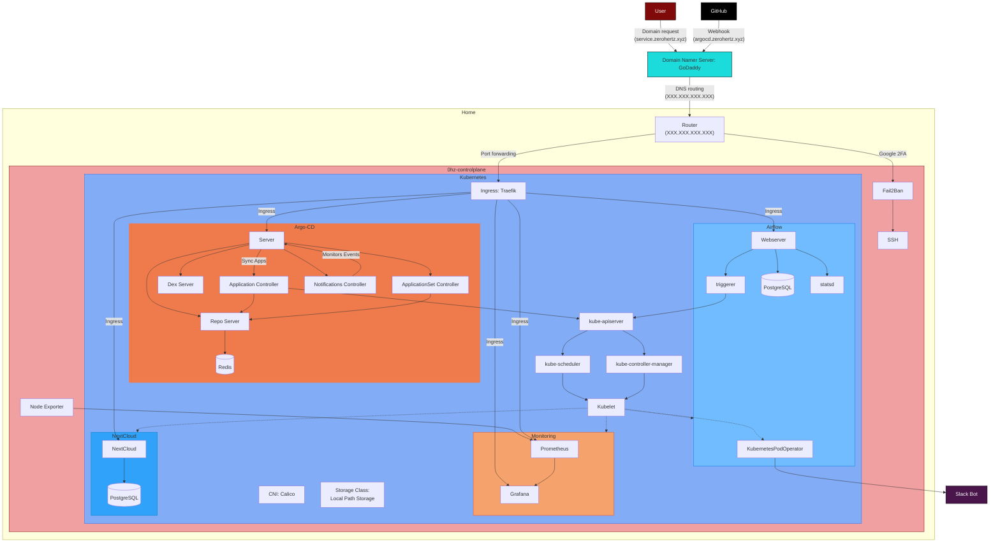

    <h1>
        🚢 Kubernetes: On-premise 🚢
    </h1>

> Kubernetes를 직접 구축해보고 서비스를 배포해보기 위한 코드들입니다.

 

    
     
    

 

|   No.   | Stacks                                                                                                                                                                                                                                                                  | Features                                                                                                                                                                                                                                         |
| :-----: | ----------------------------------------------------------------------------------------------------------------------------------------------------------------------------------------------------------------------------------------------------------------------- | ------------------------------------------------------------------------------------------------------------------------------------------------------------------------------------------------------------------------------------------------ |
| :zero:  | :o: [Kubelet](https://github.com/kubernetes/kubelet) :o: [Kubeadm](https://github.com/kubernetes/kubeadm) :o: [Kubectl](https://github.com/kubernetes/kubectl) :o: [Calico](https://github.com/projectcalico/calico)                                        | :white_check_mark: 단일 node로 실행하므로 [master node의 `taint` 변경](https://github.com/Zerohertz/k8s-on-premise/blob/v1.30.3-4.Argo-CD/sh/install_k8s.sh#L52)                                                                                 |
|  :one:  | :o: [Metrics Server](https://github.com/kubernetes-sigs/metrics-server) :o: [Local Path Provisioner](https://github.com/rancher/local-path-provisioner) :o: [MetalLB](https://github.com/metallb/metallb) :o: [Traefik](https://github.com/traefik/traefik) | :white_check_mark: [thomseddon/traefik-forward-auth](https://github.com/thomseddon/traefik-forward-auth)를 통한 [Google OAuth](https://developers.google.com/identity/protocols/oauth2?hl=ko) Middleware                                         |
|  :two:  | :o: [Argo CD](https://github.com/argoproj/argo-cd)                                                                                                                                                                                                                      |                                                                                                                                                                                                                                                  |
| :three: | :o: [Prometheus](https://github.com/prometheus/prometheus) :o: [Grafana](https://github.com/grafana/grafana)                                                                                                                                                        | :white_check_mark: [Node Exporter Full](https://grafana.com/grafana/dashboards/1860-node-exporter-full/), [Traefik Official Kubernetes Dashboard](https://grafana.com/grafana/dashboards/17347-traefik-official-kubernetes-dashboard/) 사용 가능 |
| :three: | :o: [Apache Airflow](https://github.com/apache/airflow)                                                                                                                                                                                                                 | :white_check_mark: [Kubernetes Executor](https://airflow.apache.org/docs/apache-airflow/stable/core-concepts/executor/kubernetes.html) 사용                                                                                                      |
| :three: | :o: [Nextcloud](https://github.com/nextcloud)                                                                                                                                                                                                                           | :white_check_mark: [Backend PostgreSQL 사용](https://zerohertz.github.io/home-server-cloud/#PostgreSQL)                                                                                                                                          |
|  :art:  | :o: [@rldnd](https://github.com/rldnd)                                                                                                                                                                                                                                  | :white_check_mark: 모든 서비스를 한번에 접속할 수 있는 portal 추가 :white_check_mark: [GitHub Actions 및 Argo CD 기반 CI/CD 적용](https://zerohertz.github.io/cicd-init/)                                                                    |

- 모든 서비스는 `https://${SERVICE}.${DDNS}`에 Argo CD로 배포됩니다.

  
  
  

